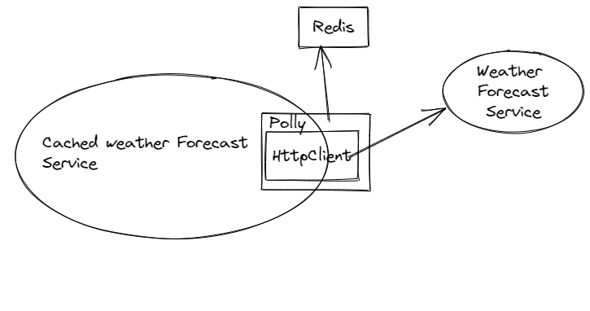

# Polly Distributed Caching

## Introduction
This is a sample app to explore Polly distributed caching with Redis

## Design of the service


Polly wrapper around Http Client to connect to external service weather forecast

## Distributed Cache Registration with Redis

[Microsoft Distributed Caching Docs](https://docs.microsoft.com/en-us/aspnet/core/performance/caching/distributed?view=aspnetcore-6.0#distributed-redis-cache)

### Package 
Microsoft.Extensions.Caching.StackExchangeRedis
```c#
// Code to regsiter redis as distributed cache using 
builder.Services.AddStackExchangeRedisCache(options => 
{ options.Configuration = "localhost:6379"; });
```

## Polly Distributed Caching

Registering Polly wrapper around HttpClient

[Polly Distributed Cache Docs](https://github.com/App-vNext/Polly.Caching.IDistributedCache)

```c#
//Register Polly Caching Policy
builder.Services.AddSingleton<IAsyncCacheProvider<List<WeatherForecast>>>(serviceProvider =>
    serviceProvider
        .GetRequiredService<IDistributedCache>()
        .AsAsyncCacheProvider<byte[]>()
        .WithSerializer(new DotnetSerializer<List<WeatherForecast>>(new JsonSerializerOptions()))
    );

//Adding the above Policy to the Polly Registery
builder.Services.AddSingleton<IReadOnlyPolicyRegistry<string>, PolicyRegistry>(serviceProvider =>
{
    var registry = new PolicyRegistry
    {
        {
            WeatherCachePolicy,
            Policy.CacheAsync(serviceProvider.GetRequiredService<IAsyncCacheProvider<List<WeatherForecast>>>(),
                TimeSpan.FromMinutes(5))
        }
    };

    return registry;
});
```

## Redis Local Setup

https://redis.io/docs/stack/get-started/install/docker/

```docker
docker run -d --name redis-stack -p 6379:6379 -p 8001:8001 redis/redis-stack:latest
```

Above command installs both Redis Stack server and RedisInsight(RedisInsight to visualize the data)

Redis Port : 6379
Redis insight port : 8001

## Tests

### Setup
Tests are written at the integration level with,
1. Wiremock mocking external service calls
2. InMemory Caching Replacing Redis cache

### Scenarios Tested
1. Storing and Retrieval from Cache for 200 status code from External service
2. Not caching non success status codes